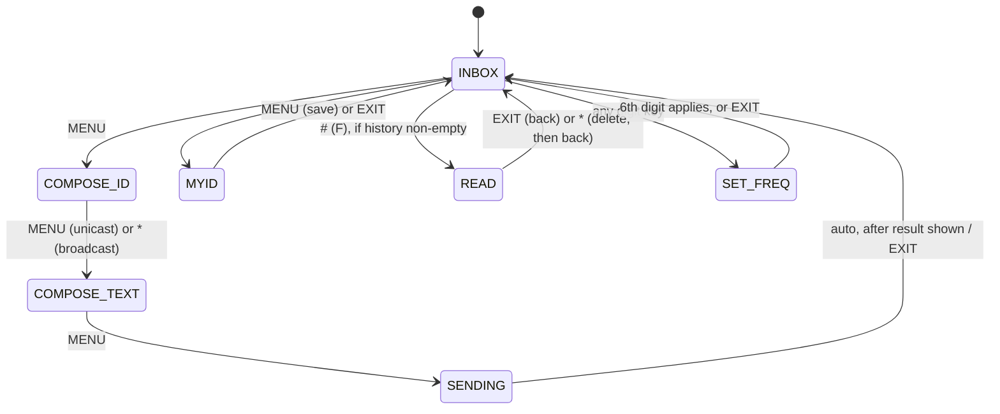
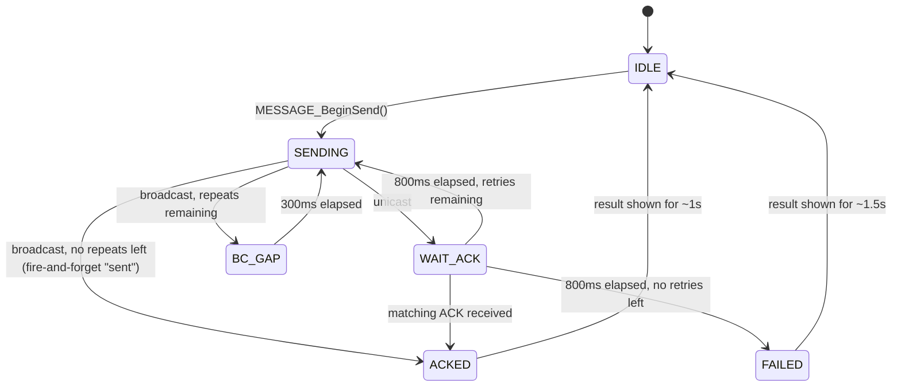

# Message (radio-to-radio SMS) — Architecture & Design

This document explains how the Message feature (`app/message.c`/`.h`,
`ui/message.c`/`.h`, gated behind `ENABLE_FEAT_F4HWN_MESSAGE`) is built, and why it's
built that way. For how to use the feature on the radio, see the
[user guide](message-feature-user-guide.md).

## Goals and constraints

- Send a short text message to a specific radio, or broadcast to everyone, over the
  air, without any external hardware.
- Confirm delivery for direct messages; tolerate loss for broadcasts.
- Fit inside the DP32G030's very tight 60K flash budget, alongside all the other
  optional features this fork already carries.
- Don't disturb the user's normal channel configuration — a Message session should
  leave no trace once you exit it.

## Relationship to AirCopy

Message deliberately reuses AirCopy's transport mechanism rather than inventing a
new one: the BK4819 transceiver chip has a dedicated FSK data modem (separate from
its normal FM/AM voice path), and AirCopy (`app/aircopy.c`) already proves that
mechanism works reliably on this hardware. Message duplicates the handful of BK4819
register writes AirCopy uses to arm that modem (`MESSAGE_SetupModem()` in
`app/message.c`, mirroring `BK4819_SetupAircopy()` in `driver/bk4819.c`, which is
only compiled in when `ENABLE_AIRCOPY` is set) so Message works standalone,
independent of whether AirCopy itself is enabled in a given build.

Where the two features differ is everything *around* the transport:

| | AirCopy | Message |
|---|---|---|
| Frequency | Hardcoded 434.000 MHz, forced identically on both radios | Whatever the user has currently tuned |
| Entry point | Boot-time key combo (PTT + lower side key) | Normal menu item, usable any time |
| VFO used | A fresh, blank `VFO_Info_t` built via `RADIO_InitInfo` | The user's live `gRxVfo`, temporarily reconfigured |
| Payload | The entire EEPROM memory (channels, settings), streamed in ~120 blocks | One short text message per frame |
| Direction | One-way (one radio sends, one receives) | Bidirectional (ACK replies, retries) |

Because Message reuses the user's live channel instead of a dedicated blank one, it
has to explicitly re-create the "clean" RF conditions AirCopy gets for free — see
[RF session setup](#rf-session-setup) below. This was the source of most of the
real-world debugging during development: several radio settings that AirCopy's fresh
VFO simply doesn't have to worry about (repeater offset, CTCSS, Dual Watch) turned
out to actively interfere with FSK reception when left at the channel's normal
values.

## Frame format

Both features share the exact same on-air frame shape: 36 `uint16_t` words (72
bytes), with the BK4819 modem's own preamble/sync-length hardware framing wrapped
around it (configured via `MESSAGE_SetupModem()`'s `REG_58`/`REG_5D` writes, at 1200
baud).

```
word[0]           0xABCD              sync marker
word[1]           packet type         1=unicast data, 2=broadcast data, 3=ACK
word[2..33]       64-byte payload     packet-type-specific (see below)
word[34]          CRC-16              CRC_Calculate() over word[1..33]
word[35]          0xDCBA              sync marker
```

`word[1]` is AirCopy's EEPROM-block-offset field, repurposed here as a packet-type
tag — the framing, CRC scope, and obfuscation are otherwise bit-for-bit identical to
AirCopy's, including the XOR obfuscation table (`Obfuscation[8]` in
`app/message.c`, duplicated rather than shared with `app/aircopy.c` so Message
doesn't depend on `ENABLE_AIRCOPY`).

### Packet payloads

```c
// Unicast or broadcast data (word[1] = 1 or 2)
typedef struct __attribute__((packed)) {
    uint16_t senderID;
    uint16_t receiverID;   // MSG_BROADCAST_ID (0xFFFF) for broadcast
    uint8_t  messageID;    // wraps 0-255; constant across retries of one message
    uint8_t  textLen;      // 0..58
    uint8_t  text[58];
} MSG_DataPacket_t;        // 2+2+1+1+58 = 64 bytes, matches the frame's payload size exactly

// Acknowledgment (word[1] = 3)
typedef struct __attribute__((packed)) {
    uint16_t ackFromID;    // = original receiverID (who is acknowledging)
    uint16_t ackToID;      // = original senderID (who sent the data)
    uint8_t  ackMessageID; // echoes the messageID being acknowledged
    uint8_t  reserved[59];
} MSG_AckPacket_t;         // 2+2+1+59 = 64 bytes
```

`messageID` is a per-radio counter (`static uint8_t gMsgIdCounter` in
`MESSAGE_BeginSend()`), not per-message-content — its only job is letting a receiver
tell a retransmission of the same logical message apart from a genuinely new one
from the same sender, so retries never show up twice in the Inbox history.

## RF session setup

`MESSAGE_Enter()` saves the live VFO/EEPROM settings it's about to override, then
forces:

- `CHANNEL_BANDWIDTH = BANDWIDTH_NARROW` — the FSK modem is tuned against a narrow
  IF filter; WIDE starves the correlator of SNR margin.
- `Modulation = MODULATION_FM` — the FSK deviation scheme assumes an FM front end.
- `TX_OFFSET_FREQUENCY_DIRECTION = OFF`, followed by `RADIO_ApplyOffset()` — forces
  simplex (TX and RX on the *exact* same frequency). A repeater channel with a
  lingering shift would otherwise send TX and RX to two different frequencies while
  looking, at a glance, like "the same channel."
- `freq_config_RX/TX.CodeType = CODE_TYPE_OFF` — no CTCSS/DCS tone riding on top of
  the FSK deviation.
- `OUTPUT_POWER = OUTPUT_POWER_HIGH`, followed by `RADIO_ConfigureSquelchAndOutputPower()`
  (which recomputes the calibration-derived `TXP_CalculatedSetting` that
  `RADIO_SetTxParameters()` actually reads) — favors range over AirCopy's own choice
  of `OUTPUT_POWER_LOW1`, which is tuned for bench testing where two radios sitting
  close together risk front-end overload/desense at higher power. Drop this back to
  a LOW level if testing radios side by side.
- `gEeprom.DUAL_WATCH`, `CROSS_BAND_RX_TX`, `BATTERY_SAVE` all forced off — these
  three drive background tasks in `app/app.c`'s `APP_TimeSlice10ms()`
  (`DualwatchAlternate()` and the power-save scheduler) that periodically swap the
  active VFO or power down the receiver, with no exclusion for the Message screen.
  Left on, they silently reprogram the BK4819 out from under the FSK setup every
  couple hundred milliseconds. AirCopy avoids this the same way, in
  `helper/boot.c`'s boot-mode handler.

Every one of these is restored verbatim in `MESSAGE_Exit()`. Only the frequency
itself is left as the user set it — intentionally, since (unlike AirCopy) Message is
meant to work on whatever channel the user is already using.

## State machines

### UI mode (`MSG_UiMode_t`, driven by `MESSAGE_ProcessKeys()`)



### TX state (`MSG_TxState_t`, driven by `MESSAGE_TimeSlice10ms()`, a 10ms scheduler
hook wired into `APP_TimeSlice10ms()` in `app/app.c`)



Retry budget: `MSG_TX_MAX_RETRIES = 3` (4 attempts total), `MSG_ACK_TIMEOUT_10MS =
80` (800ms per attempt) — bounding worst-case latency for an unacknowledged direct
message to roughly 3.5-4 seconds. Broadcasts send `MSG_BROADCAST_REPEAT_10MS = 30`
(300ms) apart, twice total, with no ACK wait.

## RX pipeline

1. **Hardware capture.** `CheckRadioInterrupts()` (`app/app.c`) polls the BK4819's
   interrupt status register every 10ms. When the `fskFifoAlmostFull` bit is set
   while `gScreenToDisplay == DISPLAY_MESSAGE`, it drains 4 words at a time from
   `BK4819_REG_5F` into `gMsg_FSK_Buffer`, calling `MESSAGE_StorePacket()` each time
   — which no-ops until all 36 words have arrived (`gFSKWriteIndex == 36`).
2. **Frame validation** (`MESSAGE_StorePacket()`): checks the hardware CRC-fail bit
   and both sync markers, de-obfuscates, then checks the software CRC. Each stage
   increments a diagnostic counter (`gMsgRxFrames`/`gMsgRxSyncFail`/`gMsgRxCrcFail`)
   surfaced on the Inbox screen, so a failure mode is visible without a debugger:
   stuck at zero frames means the correlator never locks at all (an RF-layer
   problem); frames arriving but failing sync/CRC means a garbled link.
3. **Routing.** ACK frames are matched against the currently pending outbound packet
   (sender/receiver/messageID must all match) and flip `gMsgTxState` to `ACKED`.
   Data frames not addressed to this radio (and not a broadcast) are dropped
   silently.
4. **Dedup.** Before adding a data frame to history, `(senderID, messageID)` is
   checked against all current history entries. A match means this is a retry of an
   already-seen message — it's *not* re-added to history (no duplicate entry), but a
   unicast message still gets a fresh ACK sent back regardless, in case the
   original ACK was the one that got lost.
5. **History.** `MESSAGE_PushHistory()` is a 5-slot ring buffer
   (`MSG_HISTORY_SIZE`) held in RAM only (`gMsgHistory[]`, not persisted) — when
   full, the oldest entry is dropped (`memmove`) to make room.
6. **Partial-frame timeout.** `MESSAGE_CheckPartialFrame()`, run every tick from
   `MESSAGE_TimeSlice10ms()`, watches for `gFSKWriteIndex` stalling between 1 and 35
   for more than 800ms (a burst that started but never finished, e.g. the signal
   faded) and resets/re-arms the receiver, counting it in `gMsgRxPartial` — without
   this, a stalled partial capture would sit invisibly forever with no trace on
   screen and no way to receive a subsequent frame.

## The beep/FSK register conflict

`AUDIO_PlayBeep()` (`audio.c`) drives the BK4819's tone generator through some of
the same registers `MESSAGE_SetupModem()` configures for FSK, and only restores one
of them afterward. Without intervention, *any* beep during a Message session —
including the routine per-keypress beep every screen in this firmware plays —
would silently leave the radio deaf to further frames and ACKs until the screen was
re-entered. `audio.c` calls `MESSAGE_RearmModem()` (re-applies the FSK setup and
resets `gFSKWriteIndex`) immediately after any beep played while
`gScreenToDisplay == DISPLAY_MESSAGE`. This is why the header comment on
`MESSAGE_RearmModem()` is explicit that it's called *from* `audio.c`, not from
anything inside `message.c` itself — the call site is a property of the beep system,
not of Message's own control flow, and needs to stay that way.

## Screen-rendering safety constraint

`UI_PrintString()`/`UI_PrintStringSmallNormal()` (`ui/helper.c`) center text within
a pixel range by computing `Start += ((span - Length * char_spacing) + 1) / 2` with
**no bounds checking or clipping**. For a string much longer than the available
width, this expression goes negative; since `Start` is a `uint8_t`, it wraps to a
large positive value instead of erroring, and `UI_PrintStringBuffer()` then
`memcpy()`s glyph data starting from that bogus offset — corrupting `gFrameBuffer`
past the end of the row.

Received message text (up to 58 characters, entirely attacker/sender-controlled) is
exactly the kind of unbounded input this bites. `ui/message.c`'s
`PrintTruncatedLine()` helper caps any such string to a safe ~16 characters per line
before printing — this constraint applies to *any* new line added to a Message
screen, not just the ones it's already used for; a hardcoded string under about 18
characters is safe by construction, but anything built from a counter, a user ID, or
message content needs to go through the same truncation.

## Persistence

The per-radio ID (`gEeprom.RADIO_ID`, a `uint16_t`) is the only piece of Message
state that persists across power cycles. It lives in a previously-unclaimed 8-byte
EEPROM range at `0x1F90` (between the existing "Misc" calibration block at `0x1F88`
and the F4HWN settings block at `0x1FF0`), read in `SETTINGS_InitEEPROM()`
(`settings.c`) and written via a dedicated `SETTINGS_SaveRadioID()` — kept separate
from the general `SETTINGS_SaveSettings()` so the "My ID" screen can persist
immediately without triggering a full settings save. An erased/unwritten EEPROM
value (`0xFFFF`) or `0` defaults to radio ID `1`.

## File map

| File | Role |
|---|---|
| `app/message.h` | Wire format structs, UI/TX state enums, shared globals |
| `app/message.c` | Transport (frame build/parse), TX/RX state machines, EEPROM ID, key handling |
| `ui/message.h` / `ui/message.c` | Screen rendering for every `MSG_UiMode_t` |
| `settings.h` / `settings.c` | `RADIO_ID` field, `SETTINGS_SaveRadioID()` |
| `app/app.c` | Screen/key dispatch table entries, FSK RX interrupt hook, 10ms scheduler hook |
| `audio.c` | `MESSAGE_RearmModem()` call after beeps (register-reuse fix) |
| `ui/menu.c` / `ui/menu.h` | "Msg" menu entry (in the always-visible section) |
| `ui/ui.h` / `ui/ui.c` | `DISPLAY_MESSAGE` screen enum + dispatch |
| `Makefile` | `ENABLE_FEAT_F4HWN_MESSAGE` flag (default off), object files, CFLAGS |

## Flash footprint

The DP32G030 target has 60K of flash for the entire application, already shared
among many optional features. As of this writing, enabling Message alongside the
full default feature set overflows that budget by roughly 1KB after link-time
optimization; the practical fix used during development was disabling the spectrum
analyzer (`ENABLE_SPECTRUM=0`), the single largest optional feature, which restores
several KB of headroom. This is a build-configuration tradeoff, not something fixed
in code — verify actual headroom for any given feature combination with
`arm-none-eabi-size` on the linked ELF before committing to a build.

## Design tradeoffs and known limitations

- **Foreground-only.** RX is only armed while `gScreenToDisplay == DISPLAY_MESSAGE`.
  There is no background listening mode — implementing one would mean making
  Message's FSK RX coexist with normal squelch/voice RX simultaneously, which the
  BK4819's single demodulator path doesn't support without much deeper changes.
- **Obfuscation, not encryption.** The XOR scheme (inherited from AirCopy) deters
  casual over-the-air readability, not a determined listener; there is no
  authentication either, so a receiver has no way to verify a claimed `senderID` is
  who it says it is.
- **1-byte message ID.** `messageID` wraps at 256. Dedup only checks it against
  whatever's still in the 5-slot history, so this is a non-issue in practice (a
  collision would require the same sender's ID counter to wrap all the way around
  while an old message from them is still sitting in your history), but it's worth
  knowing about if the history size or retry model changes later.
- **RAM-only history.** A deliberate choice (see the conversation that led to this
  feature) to avoid EEPROM wear/space for a feature whose message log isn't meant to
  be durable.
